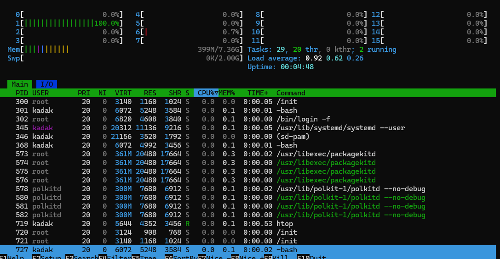
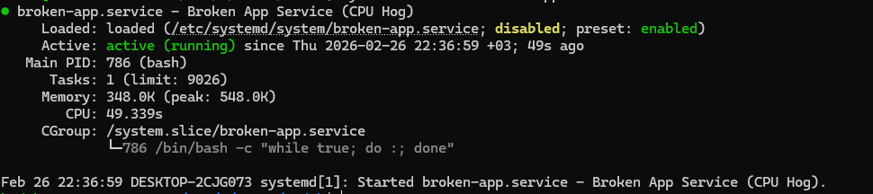

# Week 01 – Linux Incident: High CPU Usage

## Summary
A production-like Linux incident was simulated where CPU usage spiked and remained high due to a misbehaving systemd service.

## Impact
- Sustained high CPU usage on the server
- Potential performance degradation for applications running on the system
- Increased load average indicating resource contention

## Detection
The issue was detected by manually monitoring system performance using `htop`, where abnormal and persistent CPU utilization was observed.

## Evidence

- CPU spike detection using htop  
  

- Misbehaving systemd service identification  
  

## Investigation
- Used `htop` to identify a process consuming excessive CPU
- Verified the process using `ps aux`
- Identified the responsible systemd service using `systemctl status`
- Reviewed service logs with `journalctl`

## Root Cause
The CPU spike was caused by a misconfigured systemd service (`broken-app.service`) running an infinite loop without any CPU resource limits.

## Resolution
- The problematic service was stopped using `systemctl stop`
- The service was disabled to prevent it from starting automatically on reboot

## Prevention / Follow-up
- A CPU usage limit (`CPUQuota=20%`) was added to the systemd service configuration
- systemd configuration was reloaded to apply preventive measures

## Lessons Learned
- Persistent CPU spikes should be traced from process level to service level
- systemd resource limits are effective in preventing runaway services
- Early detection and controlled shutdown reduce production risk
