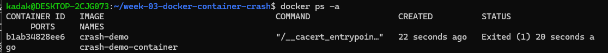
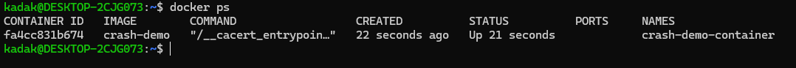

# Week 03 – Docker Container Crash Incident

## Summary

A containerized application repeatedly crashed during startup due to a missing required environment variable.

The issue prevented the application from becoming reachable and caused the container to continuously restart.

---

## Investigation

- Observed that the container was not staying in a running state.
- Checked container status using `docker ps`.
- Identified restart behavior indicating a startup failure.
- Inspected logs using `docker logs` to determine the cause of failure.

---

## Root Cause

The application expected a required environment variable for database configuration, but it was not provided during container startup.

This caused the application to fail during initialization, which led Docker to continuously restart the container.

---

## Resolution

- Provided the missing environment variable during container startup.
- Restarted the container with the correct configuration.
- Verified that the application started successfully.

---

## Prevention / Follow-up

- Ensure required environment variables are documented and validated before deployment.
- Use environment validation during application startup to fail fast with clear error messages.
- Maintain deployment documentation to prevent configuration drift.

---

## Evidence

- Container exited due to missing environment variable

- Error visible in container logs

- Container running successfully after fix

