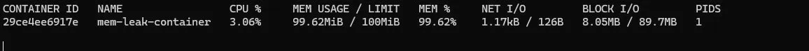
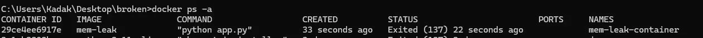
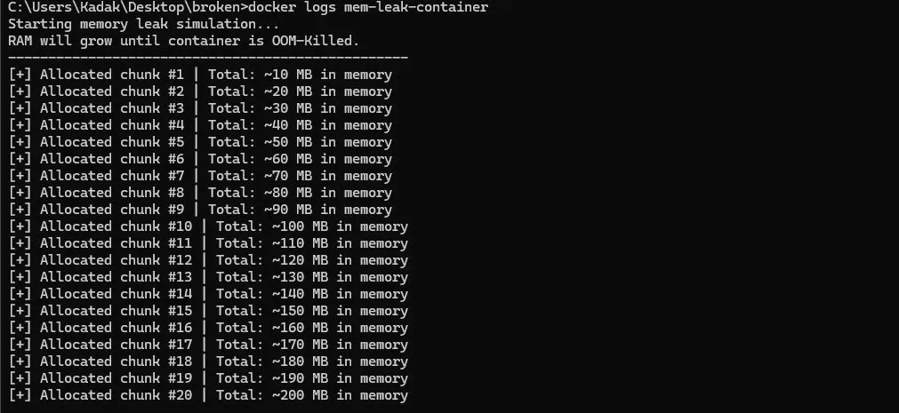
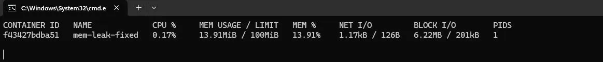

# Week 04 – Memory Leak / OOM Kill Incident

## Investigation

- Container was exiting unexpectedly after a short period.
- Checked container status using `docker ps -a` → container exited with code `137`.
- Observed continuously increasing memory usage via `docker stats`.
- Inspected logs using `docker logs mem-leak-container`.

---

## Root Cause

The application was continuously allocating memory in an infinite loop, leading to a memory leak.

Due to the configured memory limit (`-m 100m`), the container exceeded its limit and was terminated by the system (OOM Kill, exit code 137).

---

## Resolution

- Stopped and removed the failing container.
- Fixed the application logic to avoid unbounded memory allocation.
- Rebuilt and restarted the container with the same memory constraints.

---

## Prevention / Follow-up

- Always define memory limits for containers.
- Monitor memory usage using `docker stats` or monitoring tools.
- Avoid unbounded in-memory data structures in application code.
- Implement alerting for abnormal memory growth.

---

## Evidence

- Memory usage spike observed


- Container killed (Exited 137)


- Logs before crash


- Container running stable after fix


---

## Additional Analysis (Week 04)

### Exit Code 137

Exit code 137 indicates that the container was terminated by the system (SIGKILL), typically due to an Out Of Memory (OOM) condition.

---

### Timeline

- T+00s → Container started
- T+10s → Memory usage increasing
- T+50s → Memory limit reached
- T+50s → OOM Kill triggered
- T+55s → Container exited (137)

---

### Impact

- Container crashed → service unavailable
- No data loss (stateless application)
- No alerting mechanism in place

---

### Memory Leak Explanation

The issue was caused by an unbounded data structure growing indefinitely in memory.

Example (broken pattern):

```python
data = []

while True:
    data.append("A" * 10_000_000)
