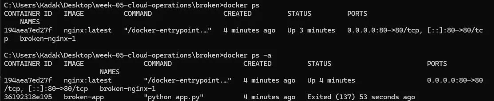
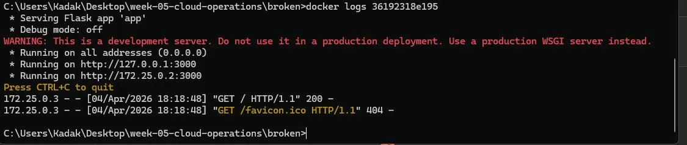
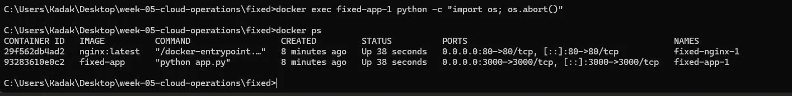

# Week 05 – NGINX 502 Bad Gateway / Container Failure Incident

> Environment: AWS EC2 (Ubuntu 22.04) — NGINX + Docker
> Region: us-east-1
> Instance type: t2.micro

## Summary
NGINX reverse proxy returned 502 Bad Gateway because the backend 
application container became unavailable. The issue was reproduced 
in a Docker environment simulating AWS EC2 production setup.

## Investigation
- Accessed service via browser → 502 Bad Gateway observed
- `docker ps` → only nginx running, app container missing
- `docker ps -a` → app container Exited (137)
- `docker logs` → app had served requests before going down

## Root Cause
Backend Flask application container stopped unexpectedly.
NGINX remained running but could not reach the backend at 
`http://app:3000`, returning 502 Bad Gateway for all requests.

## Resolution
- Added `restart: always` policy to docker-compose.yml
- Verified auto-recovery by simulating crash via `os.abort()`
- Container restarted automatically within seconds
- Service remained available without manual intervention

## Prevention / Follow-up
- Always define `restart: always` for production containers
- Implement health checks in docker-compose.yml
- Set up CloudWatch alarms for container state changes
- Use structured logging to capture crash events

## Evidence

### Screenshot 01 — App Running (Normal State)

### Screenshot 02 — 502 Bad Gateway (Broken State)

### Screenshot 03 — Docker PS Broken (Container Down)

### Screenshot 04 — Docker Logs

### Screenshot 05 — Auto Restart (Fixed State)

## Timeline
- T+00s → System running normally
- T+10s → Backend container crashed
- T+10s → NGINX begins returning 502
- T+30s → Incident detected via browser
- T+60s → Investigation started
- T+90s → Root cause identified (container down)
- T+120s → Fix applied (restart: always)
- T+130s → Service automatically restored

## Impact
- Service unavailable during container downtime
- No data loss (stateless application)
- No alerting mechanism in place (identified as gap)

## Additional Analysis

### Exit Code 137
Container terminated with SIGKILL signal — same behavior as 
AWS EC2 instance stopping due to resource exhaustion or 
external termination.

### restart: always vs AWS Auto Recovery
| Feature | Docker restart: always | AWS Auto Recovery |
|---|---|---|
| Trigger | Container crash | EC2 instance failure |
| Recovery time | ~5 seconds | 1-3 minutes |
| Config | docker-compose.yml | CloudWatch alarm |
| Manual stop | Does NOT restart | N/A |
