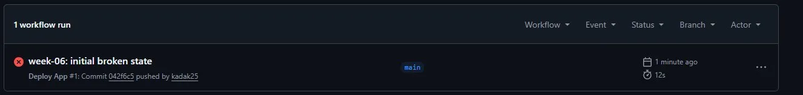
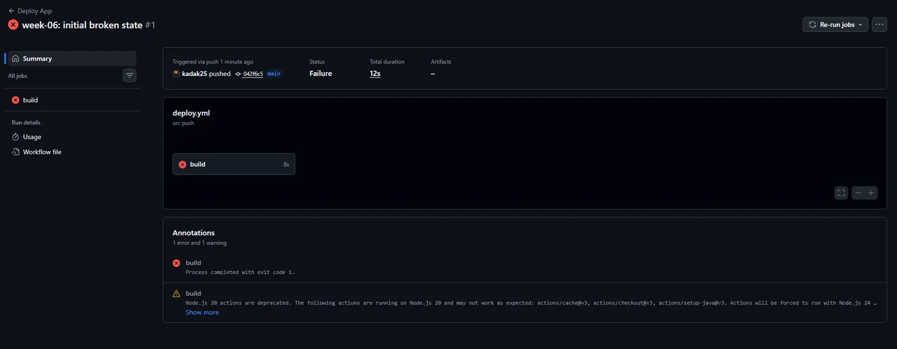
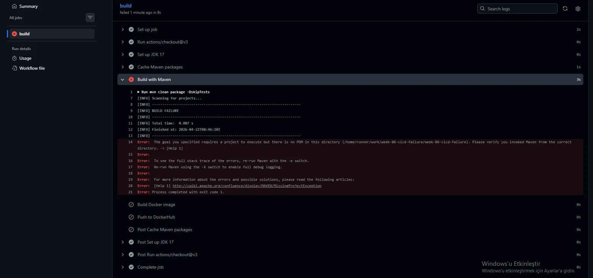
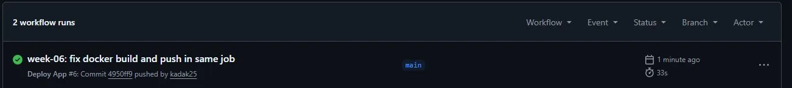
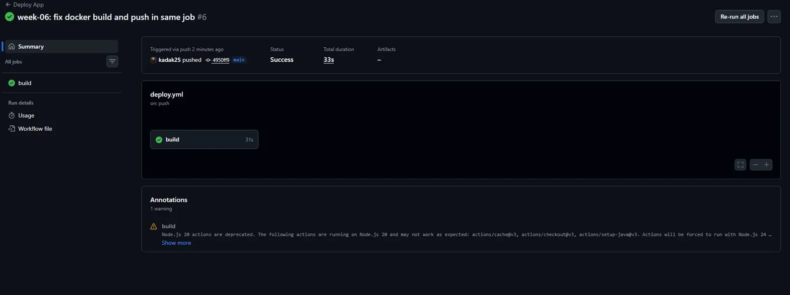
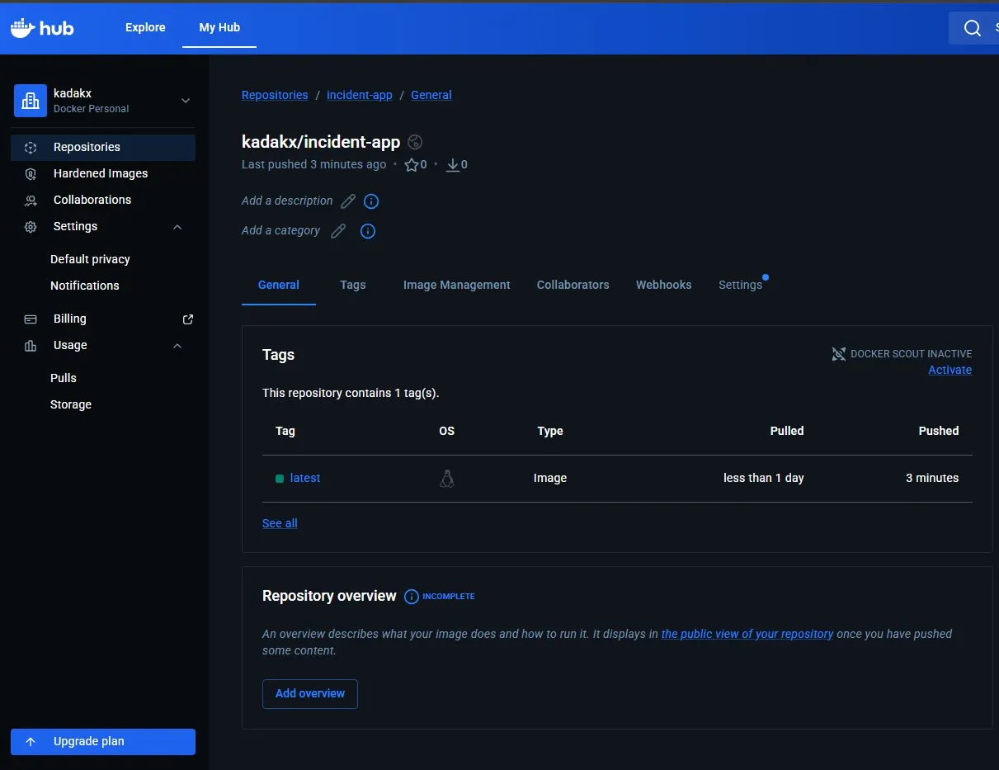

# Week 06 – CI/CD Pipeline Failure / GitHub Actions

> Environment: GitHub Actions (ubuntu-latest) — Maven + Docker + DockerHub
> Trigger: Push to main branch
> Application: Spring Boot 3.2 (incident-app)

## Summary
GitHub Actions pipeline failed immediately after a code push to `main`.
The workflow was misconfigured with an unsupported Java version, a
non-existent Maven dependency version, a wrong Dockerfile path, and
missing DockerHub credentials. Each issue caused a different stage to
fail, fully blocking the build and deployment pipeline.

## Investigation
- Pushed code to `main` → pipeline triggered automatically
- GitHub Actions tab → pipeline status: ❌ Failure
- Build stage → Maven exited with code 1 (dependency not found)
- Docker stage → `./infra/Dockerfile: no such file or directory`
- Push stage → `Must provide --username with --password-stdin`

## Root Cause
Four misconfigurations caused a cascading pipeline failure.
Java version was set to `8` in both the workflow and `pom.xml`,
which is incompatible with Spring Boot 3.x. The `pom.xml` referenced
a non-existent dependency version `99.99.99-BROKEN` that Maven could
not resolve. The Dockerfile path in the workflow pointed to
`./infra/Dockerfile`, which did not exist. Finally, `DOCKER_USERNAME`
and `DOCKER_PASSWORD` secrets were never configured in the repository
settings, causing DockerHub authentication to fail.

## Resolution
- Updated `java-version` from `8` to `17` in workflow and `pom.xml`
- Removed explicit broken version — dependency now managed by Spring Boot BOM
- Corrected Dockerfile path from `./infra/Dockerfile` to `./Dockerfile`
- Added `DOCKER_USERNAME` and `DOCKER_PASSWORD` in GitHub repository secrets
- Re-triggered pipeline → all stages passed, image pushed to DockerHub

## Prevention / Follow-up
- Always validate workflow YAML locally before merging to `main`
- Never hardcode Spring Boot sub-library versions — use parent BOM
- Run `docker build` locally before pushing pipeline changes
- Add a secrets checklist to pull request template
- Use branch protection rules to require CI pass before merge

## Evidence

### Screenshot 01 — Broken Pipeline List (Actions Tab)

### Screenshot 02 — Broken Pipeline Summary (Failure Status)

### Screenshot 03 — Broken Pipeline Log (Error Details)

### Screenshot 04 — Fixed Pipeline List (Success)

### Screenshot 05 — Fixed Pipeline Summary (All Steps Green)

### Screenshot 06 — DockerHub Image Pushed

## Timeline
- T+00s → Code pushed to main branch
- T+01s → GitHub Actions pipeline triggered automatically
- T+02s → Build stage fails — Maven cannot resolve dependency
- T+05s → Docker stage fails — Dockerfile not found
- T+06s → Push stage fails — missing DockerHub credentials
- T+10s → Pipeline marked as failed, deployment blocked
- T+45s → Root causes identified across 4 failure points
- T+90s → Fixes applied to workflow, pom.xml and Dockerfile
- T+120s → DockerHub secrets configured in repository settings
- T+153s → Pipeline re-triggered, all stages passed
- T+160s → Docker image pushed to DockerHub successfully

## Impact
- Deployment fully blocked — no new release delivered
- No data loss (pipeline failure, not runtime failure)
- No alerting mechanism in place for pipeline failures (identified as gap)

## Additional Analysis

### Pipeline Failure Cascade
Each misconfiguration blocked the next stage — the pipeline never
reached Docker or DockerHub steps until all upstream issues were fixed.

### Java Version Compatibility
| Java Version | Spring Boot 2.x | Spring Boot 3.x |
|---|---|---|
| Java 8 | ✅ Supported | ❌ Not supported |
| Java 11 | ✅ Supported | ❌ Not supported |
| Java 17 | ✅ Supported | ✅ Supported |
| Java 21 | ✅ Supported | ✅ Supported |
