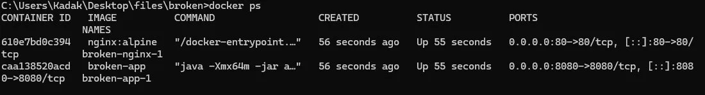
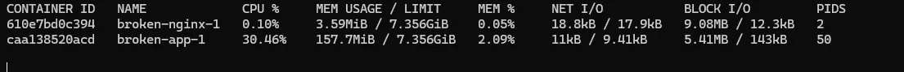
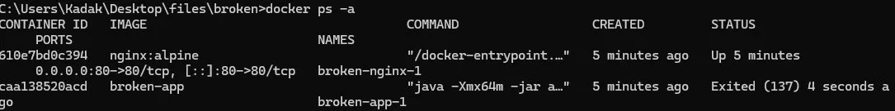
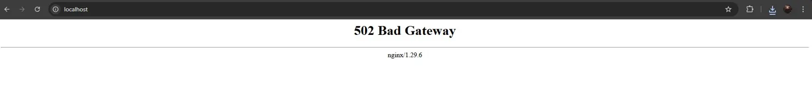
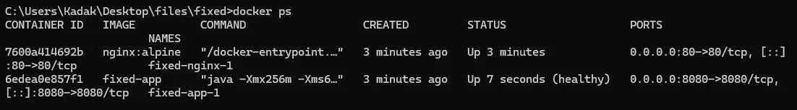
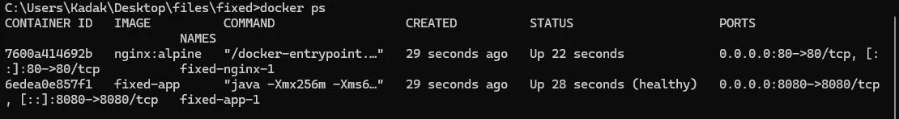

# Week 07 – Full Production Incident Simulation

> Environment: Docker (ubuntu-latest) — Spring Boot + NGINX + GitHub Actions
> Trigger: Memory leak under sustained traffic
> Application: Spring Boot 3.2 (incident-app)

## Summary
A full production meltdown was simulated across four cascading failure
points. The Spring Boot application leaked memory on every request,
exhausting the JVM heap and triggering an OOM Kill. With no restart
policy in place, the container stayed down and NGINX began returning
502 Bad Gateway to all users. The CI/CD pipeline could push a new
image but tagged everything as `latest` with no versioning, making
rollback impossible without downtime.

## Investigation
- Sent repeated requests to `/` → response times degraded progressively
- `docker stats` → memory usage climbing continuously, CPU spiking
- `docker ps` → app container disappeared after OOM Kill
- `docker ps -a` → app container Exited (137)
- `docker logs` → last entries showed requests served before crash
- `curl http://localhost` → 502 Bad Gateway from NGINX
- `docker inspect` → no restart policy defined
- DockerHub → only `latest` tag available, no previous versions

## Root Cause
The application allocated 5MB of heap memory on every HTTP request
via an unbounded static list that was never cleared. Combined with
a JVM heap cap of `-Xmx64m`, the heap was exhausted within seconds
of traffic starting. The Linux OOM Killer sent SIGKILL to the
container process, producing Exit 137. No `restart: always` policy
was defined, so Docker left the container stopped. NGINX had no
backend to proxy to and returned 502 Bad Gateway for every subsequent
request. The CI/CD pipeline only produced a `latest` tag, so there
was no versioned image to roll back to without rebuilding from source.

## Resolution
- Removed unbounded memory allocation from `IncidentApp.java`
- Raised JVM heap from `-Xmx64m` to `-Xmx256m` in Dockerfile
- Added `restart: always` and `mem_limit: 512m` to docker-compose.yml
- Added health check so NGINX waits for app to be ready before routing
- Added proxy timeouts and 503 error page to nginx.conf
- Updated CI/CD pipeline to tag images with commit SHA for rollback

## Prevention / Follow-up
- Never allocate memory per request without an explicit release strategy
- Always set JVM heap limits appropriate to expected traffic
- All production containers must define `restart: always`
- Health checks are mandatory — NGINX must not route to an unready backend
- CI/CD pipelines must produce versioned tags, not only `latest`
- Set up memory usage alerts before hitting 80% heap utilization

## Evidence

### Screenshot 01 — App Running (Normal State)

### Screenshot 02 — Memory Growing (docker stats)

### Screenshot 03 — Container OOM Killed (Exit 137)

### Screenshot 04 — 502 Bad Gateway (NGINX)

### Screenshot 05 — Fixed App Running (restart: always)

### Screenshot 06 — Auto Recovery (restart: always)

## Timeline
- T+00s → Application starts, memory usage normal
- T+05s → Requests begin, memory grows 5MB per request
- T+15s → JVM heap exhausted, OOM Killer sends SIGKILL
- T+15s → Container exits with code 137
- T+15s → NGINX begins returning 502 Bad Gateway to all users
- T+20s → Incident detected via browser / monitoring
- T+60s → Investigation started — docker stats, docker ps -a
- T+90s → Root cause identified — memory leak + no restart policy
- T+120s → Fixes applied to app, Dockerfile, docker-compose, NGINX
- T+150s → CI/CD pipeline updated with SHA versioning
- T+180s → Services restored, auto-recovery verified

## Impact
- Full service outage during container downtime
- No automatic recovery — manual intervention required
- No rollback path available via CI/CD
- No alerting in place for memory pressure (identified as gap)

## Additional Analysis

### OOM Kill vs Graceful Shutdown
| Event | Exit Code | Signal | Recovery |
|---|---|---|---|
| OOM Kill | 137 | SIGKILL | Only with restart: always |
| Graceful stop | 0 | SIGTERM | N/A |
| Manual kill | 137 | SIGKILL | Only with restart: always |

### Restart Policy Comparison
| Policy | Restarts on crash | Restarts on manual stop | Restarts on reboot |
|---|---|---|---|
| no (default) | ❌ | ❌ | ❌ |
| on-failure | ✅ | ❌ | ❌ |
| always | ✅ | ❌ | ✅ |
| unless-stopped | ✅ | ❌ | ✅ |
